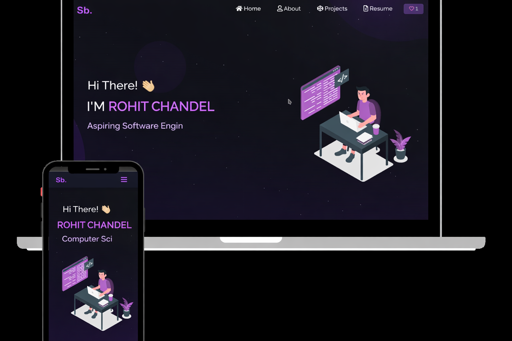

<h2 align="center">
  Rohit Chandel — Portfolio Website
</h2>

<div align="center">
  
</div>

<br/>

<center>

[](https://forthebadge.com) &nbsp;
[](https://forthebadge.com) &nbsp;
[](https://forthebadge.com) &nbsp;
 &nbsp;


</center>

<h3 align="center">
    🔹
    <a href="https://github.com/Rohoxoxo/Portfolio/issues">Report Bug</a> &nbsp; &nbsp;
    🔹
    <a href="https://github.com/Rohoxoxo/Portfolio/issues">Request Feature</a>
</h3>

---

## 📌 About This Project

This is my **personal portfolio website**, built to showcase my projects, technical skills, and resume.

**Name:** Rohit Chandel  
**Major:** Computer Science (Undergraduate)  
**University:** Southern Illinois University Edwardsville (SIUE)  
**Graduation:** May 2026  

🔗 **GitHub:** https://github.com/Rohoxoxo  

---

## 🛠 Built With

This portfolio is built using the following technologies:

- React.js
- JavaScript (ES6+)
- Node.js
- CSS3
- React-Bootstrap
- VS Code

---

## ✨ Features

- 📖 Multi-page layout (Home, About, Projects, Resume)
- 🎨 Clean and modern UI with customizable styling
- 📱 Fully responsive design for all devices
- ⚡ Fast and lightweight React-based frontend

---

## 🚀 Getting Started

Clone the repository and install dependencies:

```bash
git clone https://github.com/Rohoxoxo/Portfolio.git
cd Portfolio
npm install
npm start
